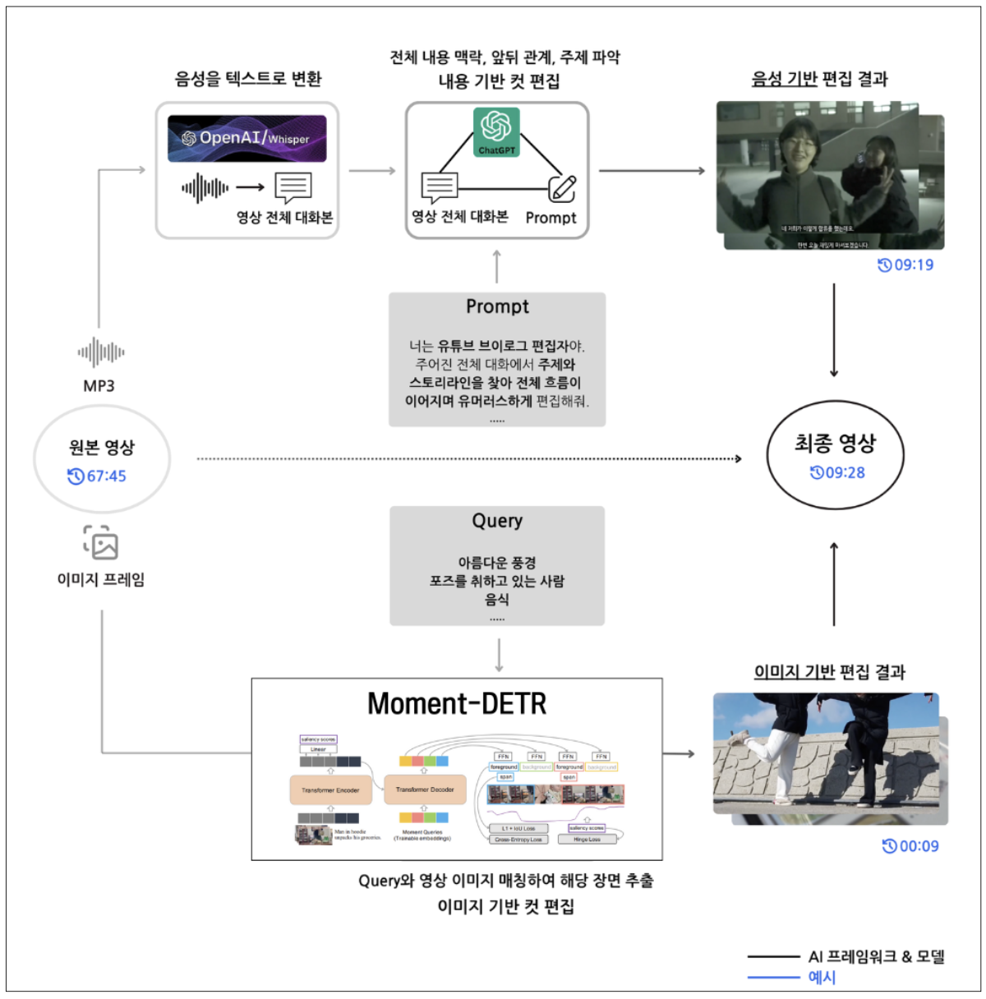
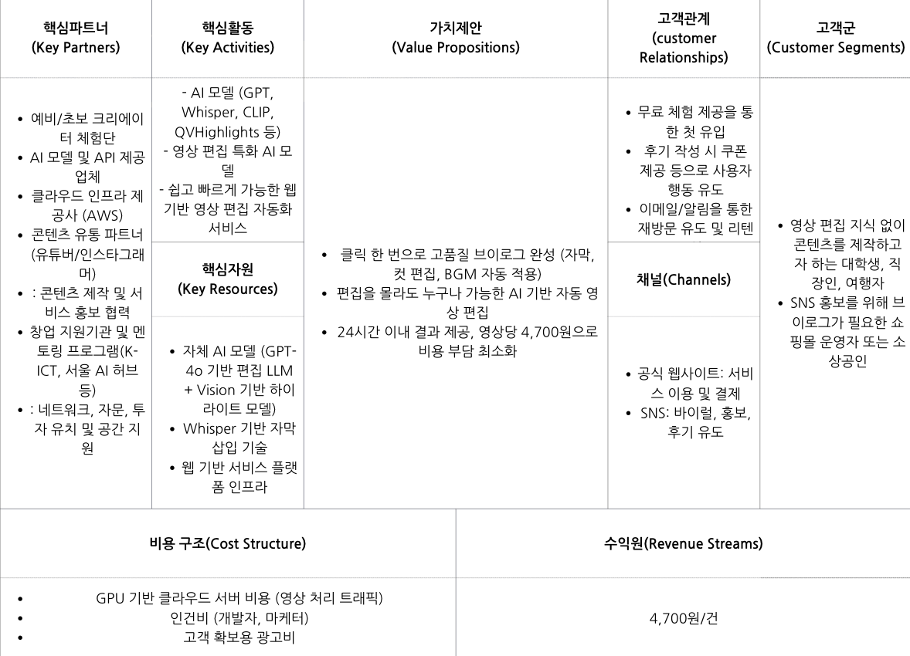

# Clipper-AI

---

## 1. 아이템 소개

### 명칭
- Clipper-AI  
- 예비·초보 크리에이터를 위한 Multi-Modal AI (LLM + Vision) 기반 자동 영상 편집 에이전트형 서비스

### 개요
- 10분 분량 영상 편집 → 평균 5~10시간 소요, 외주 비용 10~20만 원
- 노동집약적인 편집 과정을 대신해 클릭 몇 번만으로 결과물 생성
- 무편집 영상 업로드 + 편집 프롬프트 입력 → 24시간 이내 편집본 제공
- 영상 발화 맥락을 이해하는 LLM + 장면을 인식하는 Vision 결합
- 건당 4,700원 (커피 한 잔 가격, 외주 대비 85~90% 절감)

---

## 2. 문제 인식 (Problem)

### 시장 현황
- 2023년 미디어 산업: 약 10조 원 규모
- 성인 남녀 63% 유튜브 도전 의향, 그 중 31% 브이로그 희망
- 희망자 중 81%: 편집 시간 및 비용 부담 때문에 시작/지속 어려움
- 기존 서비스 한계:
  - 템플릿 기반 숏폼 위주 (CapCut, TikTok Auto Cut 등)
  - 맥락 이해 및 자연스러운 편집 한계
  - 외주 비용: 5~20만 원 / 5~10시간 소요

---

## 3. 실현 가능성 (Solution)

### 개발 계획
- 시장조사 → 아이디어 빌드업 → MVP 개발 및 런칭
- 현재 웹 기반 영상 편집 서비스 개발 완료
- 협약 기간 내 서비스 배포 예정

### 차별성 및 경쟁력
- **LLM + Vision Multi-Modal AI**: 음성과 시각 정보를 함께 분석
- 자연스럽고 스토리텔링 중심 컷 편집 제공
- 외주 대비 90%, 기존 툴 대비 85% 비용 절감
- 기술·가격 경쟁력 확보

---

## 4. 핵심 기능 (AI 프레임워크)

## 핵심 기능 구현 방법

| 기능 | 설명 | 사용 기술 | 구현 방법 |
|------|------|-----------|-----------|
| **① 자동 자막 생성** | - 편집 내용: 발화 내용을 텍스트로 변환, 화면에 자막 형태로 출력 | - 음성 인식, 자연어처리, 자막 동기화   - OpenAI Whisper Large v3 | - 하이퍼파라미터 튜닝을 통해 할루시네이션 최소화 |
| **② 내용 기반 컷 편집** | - 편집 내용: (①에서 추출한 영상) 전체 대화 분석 → LLM이 맥락 및 기승전결 스토리라인 구축   - 브이로그 주제와 관련된 재미있는 내용만 컷 편집 | - OpenAI GPT-4o (대규모 언어모델) | - GPT-4o를 Prompting·Fine-tuning하여 영상 편집에 최적화된 자연어처리 모델 개발 |
| **③ 이미지 기반 컷 편집** | - 편집 내용: 랜드마크, 아름다운 풍경, 음식, 포즈를 취하는 사람 장면의 하이라이트 | - OpenAI CLIP (이미지-텍스트 매칭 모델) | - CLIP 모델에 QVHighlights 방법론을 적용해 브이로그에서 중요한 장면을 추출할 수 있는 이미지 모델 개발 |

---

### 📌 내용 기반 컷 편집의 세부 원리
- **맥락 파악**: Self-Attention 메커니즘을 통해 문장 내 단어 간 관계를 수치화 → 필요한 문맥 보존  
- **중요도 파악 및 스토리라인 유지**: 영화, 유튜브, 인터뷰 등 다양한 콘텐츠 유형을 학습해 자연스러운 흐름 구성  
- **LLM 편집에 최적화**: Prompting을 통해 주제 벗어난 내용·단조롭고 정보 없는 대화 삭제 → 맥락·스토리라인 고려

---

## 5. 시장 분석 및 차별성

### 비교: 기존 편집 툴
| 서비스 | 편의성 | 소요 시간 | 필요 숙련도 | 맥락 인지 | 경제성 |
|--------|--------|-----------|-------------|-----------|---------|
| Clipper-AI | ◎ | ◎ | ◎ | ○ | ◎ |
| CapCut / TikTok AutoCut | ○ | ○ | ○ | △ | ○ |
| Adobe | ○ | ○ | ○ | △ | △ |
| Canva | △ | △ | △ | △ | △ |
| 구글 포토 | ◎ | △ | X | X | ◎ |

- 기존 서비스: 템플릿 기반, 편집자는 직접 개입 필요
- Clipper-AI: 업로드만 하면 완전 자동 편집 가능 (AI Agent)

### 인간 편집자와 비교
- 컷 편집 일치율: 71.2%
- 고객 만족도 목표: 80% 이상
- 고객 재사용 의향: 90% 이상

---

## 6. 사용자 반응 

- 긍정: “정식 출시되면 꾸준히 사용”, “퀄리티가 상당히 좋다”
- 부정: “편집 효과가 부족하다”, “사람의 감성 편집이 필요하다”
- 개선 방향: 편집 효과 기능·맞춤형 옵션 강화

---
## 7. 사업화 추진 전략 (Scale-up)

### 비즈니스 모델
- 과금: 편당 4,700원
- 초기 타겟: B2C (예비·초보 크리에이터)
- 확장: B2S(학교), 글로벌 크리에이터, SNS 플랫폼

### 마케팅 전략
1. 초기: SNS/대학 커뮤니티, 문제 해결형 콘텐츠 배포
2. 콘텐츠 마케팅 & SEO
3. CRM: 이메일·푸시 알림, 할인·업데이트 알림
4. 온드/언드 미디어: 블로그, 유튜브, 리뷰 이벤트

---

